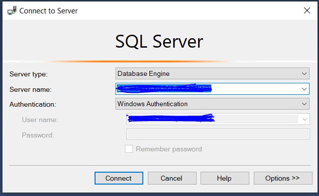
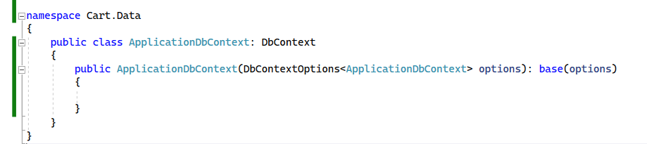
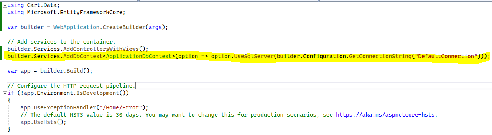

# What is EntityFramework

- It is a Framework that helps to access any SQL Database using code.

# Pre-requisites

- Any SQL Database Server. We can use MS SQL as example. Link - https://www.microsoft.com/en-IN/sql-server/sql-server-downloads
- Management system/studio for the SQL Database. We are consider MS SQL Management Studio - https://learn.microsoft.com/en-us/sql/ssms/download-sql-server-management-studio-ssms?view=sql-server-ver16

## Dependency Packages

- To use Entity framework with DB, 3 Nuget packages needs to be added to the project
  1. Microsoft.EntityFrameworkCore
  2. Microsoft.EntityFrameworkCore.Tools - This is required to work with migration related commands
  3. Microsoft.EntityFrameworkCore.SqlServer

# Interacting with DB

## Connection String

- To connect to SQL DB, we need its connection string. Connection string consists of server name and DB name
  - Server Name: This can be obtained by launching SSMS. Launch SSMS, a connect to server window will be opened which will have the connection string 
  - DB Name: Any DB name can be given
- Connection string needs to be mentioned in the `appsettings.json` file with the below syntax. In addition to Server Name and DB Name, `Trusted_Connection` and `TrustServerCertificate` needs to be set to true.

```csharp
"ConnectionStrings":
{
    "DefaultConnection":"Server=<serverName>; Database=<DatabaseName>; Trusted_Connection=True; TrustServerCertificate=True"
}
```

# DBContext

- To communicate with SQL DB, we should use a `DBContext` parent class and do migration.
- Steps to setup DBContext

  1. Create a class which inherits from `DBContext`.

  - Suggestion is to create this in a folder called as `Data` parallel to Controller and name this as `ApplicationDbContext.cs`
  - Add a constructor which takes in `DbContextOptions<ApplicationDbContext>` as argument and passes it to the base
    

  2. Add DBContext to the services in `Program.cs` <br/>

  - When adding the DBContext to services, set option to use SQLServer <br/>
  - Pass the connection string property as argument to this
    

## Logging Queries

- When adding DBContext in `Program.cs`, we can add an option to specify where the queries needs to get logged to, this can be done by adding the `LogTo(FunctionNameToLog)`<br\>
  **Example:**

```csharp
  builder.services.AddDbContext<ApplicationDbContext>(
    option => option.UseSqlServer(builder.Configuration.GetConnectionString("DefaultConnection")).LogTo(Console.WriteLine));
```

- We can filter the logs by passing the type and command name as below

```csharp
builder.Services.AddDbContext<ApplicationDbContext>(
    option => option.UseSqlServer(builder.Configuration.GetConnectionString("DefaultConnection"))
    .LogTo(Console.WriteLine, new[] {DbLoggerCategory.Database.Command.Name}, LogLevel.Information));
```

# Creating DB

- After setting up the `ApplicationDBContext` and `Program.cs`, open `Package Manger Console(PM Console)` by using `Tools -> Package Manager Console` and run the command `update-database`
- A table called `_EFMigrationHistory` will be present in the database which will track any migration that is being performed
- This should be run in the project having DbContext
- This will create the Database with name mentioned in the connection string

# Creating Tables

## Creating Models

- To create tables in SQL using Entity Framework, we needn't directly do it. We can create a table and entity Framework will take care of creating it in the DB during migration process.

### Rules for Creating Models for Tables

- Model corresponding to each table should create a _Primary Key_ property. There are three ways to make a property primary key
  1. By naming it `Id`
  2. By naming it `{ModelName}Id`
  3. If the above 2 cannot be done, you can give any convenient name and use the annotation `[Key]`
- If a column in DB should be made `Non-nullable`, then use the attribute `[Required]` for the corresponding property

### Creating Tables using PM Console

- After creating the required model, add a property of type `DbSet<>` corresponding to the model in the `ApplicationDbContext`
- Format

```csharp
    DbSet<Name of the model> Name of the table {get; set;};
```

Example:

```csharp
    DbSet<Category> Categories {get; set;};
```

- After adding this, open the PM Console and add a migration using the command `add-migration {Name}` Eg: `add-migration CreateCategoryTable`. This step will create a _Migration_ folder if not present and add the current migration with date time to this folder.
- Then run the `update-database` command in the PM Console. This will apply the migration to database. Hence a table corresponding to the collection will be added to DB.

## Seeding Table Data

- For this `OnModelCreating` needs to be overridden in the `ApplicationDbContext`. This will has access to `ModelBuilder` using which we can seed data.
  Syntax:

```csharp
   modelBuilder.Entity<ModelToAddData>().HasData( new ModelObjects)
```

Example

```csharp
    protected override void OnModelCreating(ModelBuilder modelBuilder)
    {
        modelBuilder.Entity<Category>().HasData(
            new Category { Id = 1, Name = "Action", DisplayOrder = 1 },
            new Category { Id = 2, Name = "Comedy", DisplayOrder = 2 },
            new Category { Id = 3, Name = "Thriller", DisplayOrder = 3 });
    }
```

# Accessing DB Data using Entity Core

- Create an instance of the `ApplicationDbContext` that can be used to read and write data to DB

  ```csharp
    using (ApplicationDbContext context = new())
  ```

  ## Check if Database is Created and Migrations are Done

  - Before performing any operations in DB, we can check if DB is created and migrations are done as below

    ```csharp
      using (ApplicationDbContext context = new())
      {
        context.Database.EnsureCreated();
        if(context.Database.GetPendingMigrations().Count()>0)
        {
          context.Database.Migrate();
        }
      }
    ```

  ## Reading Data from DB

  - We can directly use the appropriate table in DB and convert the value to list

    ```csharp
    using (ApplicationDbContext context = new())
    {
      IList<Category> = context.Categories.ToList();
    }
    ```

  ## Reading Multiple data from DB

  - We can directly use the appropriate table in DB and convert the value to list. <br/>
    **Syntax:**

    ```csharp
      context.TableName.ToList();
    ```

    ```csharp
    using (ApplicationDbContext context = new())
    {
      IList<Category> categories = context.Categories.ToList();
    }
    ```

  ## Reading One data from DB

  - We can directly use the appropriate table in DB and convert the value to list.
  - We can use the following

    - `First`: to read only the first value from DB, this will throw exception if no values are present in DB. It takes an ID argument, passing a number will match the DB record with ID matching the number.
    - `FirstOrDefault`: to read the first value, if no data is found exception will not be thrown. This also takes an argument which matches the given condition.
    - `Where`: We can filter a list of values that matches a certain criteria using `Where`.
    - `Single`: takes a condition and returns the value matching the condition. Single expects only one value that matches the condition, if it finds 2 or more values, an error will be thrown
    - `SingleOrDefault`: takes a condition and returns the value matching the condition. Works similar to single but doesn't throw error if no value is found.
    - `Contains`: Return a value that is containing a given string.

      **Syntax:**

    ```csharp
      context.TableName.First();
      context.TableName.FirstOrDefault();
      context.TableName.FirstOrDefault(u => u.Id == 10);
      context.TableName.Where(u => u.Id == 10);
      context.TableName.SingleOrDefault(u => u.Id == 10);
    ```

    ```csharp
    using (ApplicationDbContext context = new())
    {
      Category category1 = context.Categories.First();
      Category category2 = context.Categories.FirstOrDefault();
      List<Category> categories = context.Categories.Where(category => category.Id == 10);
    }
    ```

## Creating Data in DB

- Create the new item, during this we have to skip giving value to ID column. We can add it to the table and save the changes to DB. <br/>
  **Syntax:**

  ```csharp
    context.TableName.Add(newItem);
    context.SaveChanges();
  ```

  ```csharp
    Category newCategory = new Category() {Name = "Horror", DisplayOrder = 4};
    context.Categories.Add(newCategory);
    context.SaveChanges();
  ```

## Preventing SQL Injection Attack

- If a data is passed directly, Eg: when using Find, it might cause SQL injection attack. This can be avoided by assigning the data to a variable and using it in the Entity FW methods.
