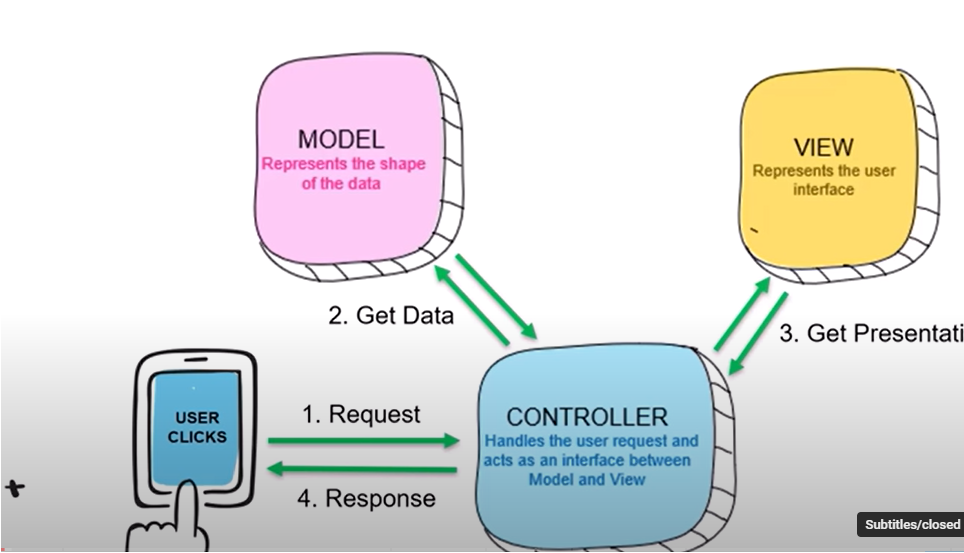

# MVC

Abbreviation for _Model-View-Controller_

## Model

- Data model for UI, DB and others

## View

- Represents the UI
- This will control the HTML elements

## Controller

- Heart of the MVC pattern
- Interface between model and views

## User Flow

- User sends a request, it comes to the Controller
- Controller then uses model to get data from database and do other processes.
- The data is then sent to the View where the HTML elements are updated and given to the controller.
- The controller returns the HTML elements as response
  
  `Note: The above image is from course, hence needs to be updated for publishing in public sites`

# Routing

- This defines the way in which the requests are routed to a controller file and a method
