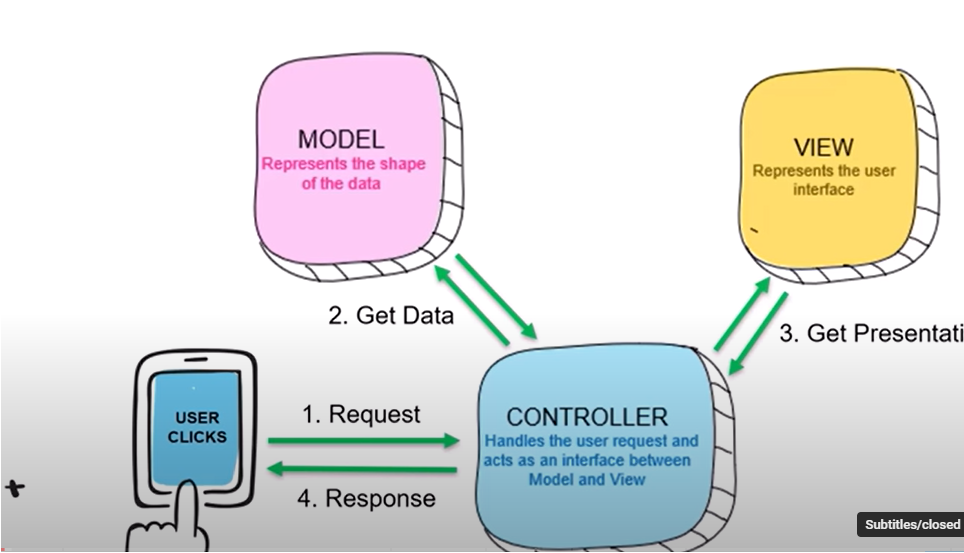

# MVC

- Abbreviation for _Model-View-Controller_
- Design pattern
- Enforces separation of concern - Help you to avoid mixing of presentation logic, business logic and data access logic

## Model

- Data model for UI, DB and others
- Manages the behavior and data

## View

- This is the UI part
- Views are of type `.cshtml`, which will have both HTML and C# content
- C# part is used for dynamic content generation
- This HTML + C# content is called `Razor Pages`
- The data for the pages comes from Controller and will be dynamically combines with HTML

## Controller

- Heart of the MVC pattern
- Interface between model and views
- Handles page events and navigation between pages
- Decides when to load a page and provides data to be shown

## User Flow

- User sends a request, it comes to the router
- Router invokes the Controller
- Controller then uses model to get data from database and do other processes.
- The data is then sent to the View where the HTML elements are updated and given to the controller.
- The controller returns the HTML elements as response
  
  
  `Note: The above images are from courses, hence needs to be updated for publishing in public sites`

# Routing

- This defines the way in which the requests are routed to a controller file and a method

# IIS

- Information Internet Server
- Microsoft's web server
